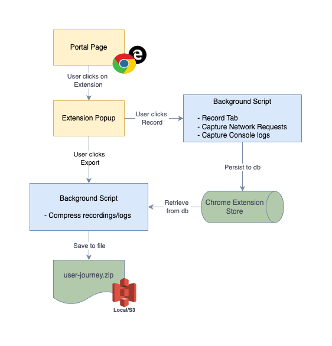

# One CaptureKit
A chrome extension to record user journey on a website to be used by servicing team. 

## Background
Currently, whenever any production issue occurs, it becomes a difficulty to capture relevant data for issue triaging by the development/support team.
- Developers don't have access to production environments.
- CCPs are often not able to collate necessary data in the incident ticket.
- Recreating the issue becomes difficult especially in case of intermittent issues.
- Few scenarios are difficult to be written in jira tickets.

## Our Solution
We are building a chrome extension to solve this problem as below.
1. Users/CCPs need to install the extension and enable on their machines.
2. This will record the user activity on the website while capturing screen recording, network requests and console logs. 
3. The recordings along with network and console logs will be exported into an encrypted zip file and uploaded to a remote location.
4. Finally, an incident ticket will be created for the same with link to the recording.

## Architecture

## Challenges
Currently, Amex does not allow installing chrome extension from the WebStore or side-loading it locally. All chrome extensions are blocked by default and only a select few are white-listed from the ITPR team. 

Getting a chrome extension whitelisted needs a lot of approval and as such is a slow process. Will need leaders guidance and help in this regard.